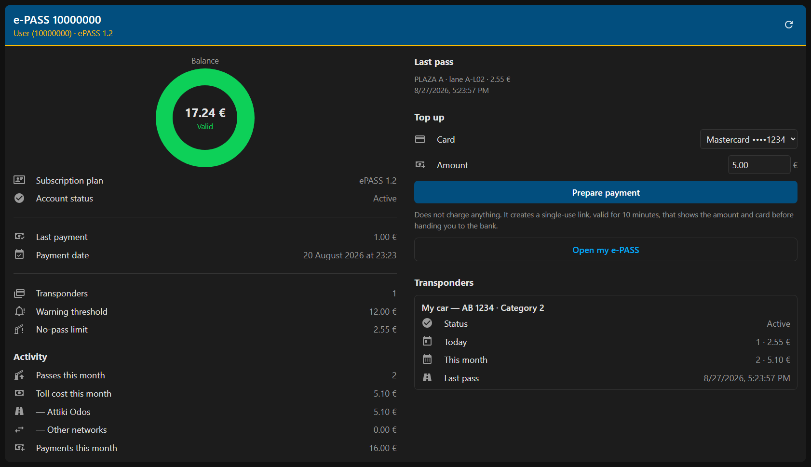
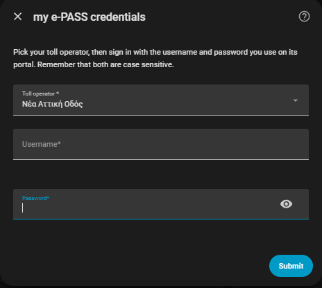
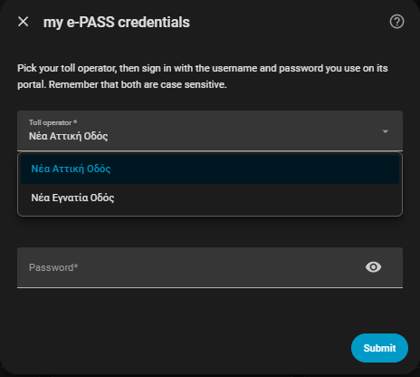

# GR e-PASS for Home Assistant

[Ελληνικά](README.md) · **English**

Custom integration that brings **prepaid Greek toll accounts** into Home
Assistant. It supports **Nea Attiki Odos**
([epass.naodos.gr](https://epass.naodos.gr/)) and **Nea Egnatia Odos**
([myegnatiapass.gr](https://myegnatiapass.gr/)) — you pick the operator when
adding it. It brings balance,
passes, cost and statistics — account-wide and per transponder — plus a
low-balance warning and one-tap top-up.

Attiki Odos and Egnatia Odos are tolled Greek motorways. e-PASS is the
prepaid electronic toll subscription used on them.

> **There is no public API.** Every endpoint was derived from the site's own
> Angular bundle. They work today but may change without notice. This is not an
> official product of any of the concession companies.

<p align="center">
  
</p>

<p align="center">
  <em>The "e-PASS" page, which appears in the sidebar on its own after install.
  Customer number, card and last pass are sample values.</em>
</p>

---

## What it does

During setup:

1. You enter your my e-PASS **username and password**.
2. If your login holds **several subscriptions**, you pick which one to add
   (repeat the flow for the others).
3. You choose **which transponders** to track: "All" (including any added later)
   or specific ones.

After that, every 30 minutes (configurable 10–1440) the integration fetches the
subscription details and recent activity, and computes the statistics locally.

## The "e-PASS" page

As soon as the integration is added, an **e-PASS** page appears in the sidebar.
There is no dashboard to build and no YAML to write, and it follows the Home
Assistant language — Greek or English.

It shows the balance in the portal's own colours, the subscription details, this
month's activity, the last pass, the top-up controls, and a section per
transponder with its vehicle category and its own passes. On a desktop window it
splits into two columns; on a phone it stacks into one.

The **Prepare payment** button charges nothing: it creates a single-use link,
valid for 10 minutes, that shows the amount and card before handing you to the
bank's own page. Details under
[Topping up](#topping-up-from-home-assistant).

## Installation

### HACS (custom repository)

1. HACS → Integrations → ⋮ → **Custom repositories**
2. Paste the repository URL, category **Integration**
3. Install, then **restart** Home Assistant
4. Settings → Devices & Services → **Add Integration** → `GR e-PASS`

### Manually

Copy `custom_components/gr_epass` into your Home Assistant
`config/custom_components/` and restart.

### Adding it

<p align="center">
  
  &nbsp;
  
</p>

Pick the operator, then sign in with the credentials you use on **its** portal —
the same username exists independently on each one. If the account has several
subscriptions a picker follows, and then the transponder selection.

## Options

Settings → Devices & Services → GR e-PASS → **Configure**:

- **Transponders** — change the selection
- **Update interval** — 10 to 1440 minutes (default 30)

If you change your password on the website, Home Assistant asks you to
re-authenticate automatically.

## Entities

> Entity ids are always generated from the **English** names, whatever language
> Home Assistant runs in: `sensor.e_pass_123456_balance`. Only the friendly name
> is translated. Check the real ids in Developer Tools → States, filtered by
> `e_pass`.

### Device: the subscription (`e-PASS <AccountID>`)

| Entity | Description |
| --- | --- |
| `sensor.*_balance` | Balance (€) — **positive means credit available**, negative means owed |
| `sensor.*_balance_status` | Valid / Low / Invalid |
| `sensor.*_last_payment` + `sensor.*_last_payment_date` | Amount and date of the last payment |
| `sensor.*_last_statement` | Date of the last statement, with `issue_number` in the attributes |
| `sensor.*_last_pass` | Timestamp of the last pass, with plaza, lane and amount as attributes |
| `sensor.*_passes_today` / `sensor.*_cost_today` | Passes and cost today |
| `sensor.*_passes_this_month` / `sensor.*_cost_this_month` | Since the 1st of the month |
| `sensor.*_cost_this_month_attiki_odos` | Passes on the operator's own network only |
| `sensor.*_cost_this_month_other_motorways` | Other networks, via interoperability |
| `sensor.*_passes_last_30_days` / `sensor.*_cost_last_30_days` | Rolling 30-day window |
| `sensor.*_passes_previous_month` / `sensor.*_cost_previous_month` | Full previous month |
| `sensor.*_payments_this_month` | Sum of top-ups this month (€) |
| `sensor.*_transponders` | How many transponders are tracked |
| `sensor.*_account_status` | Diagnostic: Active / Inactive / etc. |
| `sensor.*_stored_cards` | Diagnostic: number of tokenised cards, list in the attributes |
| `sensor.*_card_expiry` | Diagnostic: when the soonest card expires |
| `sensor.*_invalid_balance_limit` | Diagnostic: below this, no pass is allowed |

### Controls

| Entity | Description |
| --- | --- |
| `number.*_low_balance_threshold` | When you want to be warned. Defaults to the official limit **for your own vehicle category** |
| `select.*_payment_card` | Which stored card a top-up should reuse |
| `number.*_top_up_amount` | Top-up amount. Defaults to the category's recharge limit; bounds come from the gateway |
| `button.*_prepare_top_up` | Requests a signed order. **Does not charge anything** |

You do not need to create a helper: the thresholds arrive ready, matched to your
transponders' category, and you can change them from the UI.

### Device: each transponder

The same pass/cost statistics (today, month, 30 days, previous month), a
`Last pass` sensor, and a diagnostic `Status` (Active / Restricted) with
attributes: transponder number, alias, plate, make/model, toll category,
`trip_status`, `trip_count`, distribution date.

If you track only some transponders, the account-wide sensors count **only
those**, so the figures match the devices you can see. Payments and
administrative charges always land in the account total, because they do not
belong to any transponder.

## Reading the numbers

**The sign.** The portal keeps a ledger where `AccountBalance` is **negative
when you hold credit**: the API's `-13.79` is shown by the portal as
`13,79 € Π` (Π = credit, Χ = debit). The `Balance` sensor flips the sign, so
**positive means money available**.

**`Balance status` maps to official limits**, not to anything this integration
computes. From the
[Prepaid e-PASS price list](https://www.naodos.gr/diodia-e-pass/thelo-na-apoktiso-e-pass/timokatalogos-e-pass/)
(effective 2026-01-01), per e-PASS device:

| Limit | Cat. 1 | Cat. 2,3,4 | Cat. 5 & 6 |
| --- | --- | --- | --- |
| Credit-card recharge (standing order) | €10.00 | €20.00 | €50.00 |
| Low account warning | €6.00 | €12.00 | €40.00 |
| Invalid account | €1.25 | €2.55 | €10.10 |

- `Valid` = above the warning limit
- `Low` = below it
- `Invalid` = below the invalid-account limit, where **no subscriber pass is
  allowed** — only a staffed lane

The invalid-account limit equals one toll for the category. Your transponder's
category is in its `toll_category` attribute.

**`cost_*` counts toll charges only** (`TransactionType 02`) — not transponder
fees, administrative charges or adjustments.

**Calendar-period amounts** carry `state_class: total` and feed long-term
statistics. The rolling 30-day cost has **no** state class: it is not a meter,
it falls as old days leave the window, and Home Assistant rejects `measurement`
together with `device_class: monetary`.

## Events

The integration fires bus events so you can write whatever automation you like
instead of us guessing your notification channel.

| Event | Data |
| --- | --- |
| `gr_epass_pass` | `account_id`, `timestamp`, `amount`, `plaza`, `lane`, `transponder_id`, `toll_category`, `external_network` |
| `gr_epass_balance_changed` | `account_id`, `balance`, `previous_balance`, `delta`, `direction` |
| `gr_epass_payment_ready` | `account_id`, `amount`, `card`, `order_id`, `link`, `expires` |

Passes are recorded silently on the first refresh, and anything older than six
hours is ignored, so a restart cannot replay history.

## Topping up from Home Assistant

Home Assistant **cannot charge a card**, and no integration can. The e-PASS
backend only **signs** an order; the charge completes when those fields are
submitted as an HTML form by a browser to Alpha Bank's hosted page, where 3-D
Secure runs. There is no endpoint that charges a stored card server-side.

What does work:

1. Pick a card (`select`) and an amount (`number`).
2. Press `button.*_prepare_top_up`. An order is signed — **no charge**.
3. A **single-use** link is published, valid for 10 minutes, in the button's
   `link` attribute and in the `gr_epass_payment_ready` event.
4. Opening it shows the amount and card. One click hands off to the bank and
   completes the charge.

The link is deliberately unauthenticated so it opens with one tap from a chat
message on a phone. It is protected by a 128-bit nonce, single use, a 10-minute
expiry, and by the amount and card being locked into the signature — the link
cannot be edited into a different charge. The worst a leaked link can do is top
up the owner's own toll balance.

**The first charge has to happen on the portal**, with "save card" ticked.
`SaveStoredCard` only stores an alias; the token is minted by the bank during a
real payment, so a card cannot be added from here.

Protocol details: [`docs/PAYMENT_API.md`](docs/PAYMENT_API.md).

### Standing order

The price list describes a "credit-card recharge limit" that *"automatically
triggers the standing order"*. The **portal does not expose it** — there is no
route and no endpoint. If you want genuinely automatic top-up, the operator sets
it up (+30 210 6682222) and it runs bank-side, independent of Home Assistant.

## Example automation: low balance warning

The threshold is an entity the integration provides, so it already matches your
vehicle category and you can change it from the UI.

```yaml
automation:
  - alias: e-PASS low balance
    triggers:
      # numeric_state fires on crossing the threshold, so it will not spam.
      # for: stops a single refresh or restart from triggering it.
      - trigger: numeric_state
        entity_id: sensor.e_pass_123456_balance
        below: number.e_pass_123456_low_balance_threshold
        for: "00:10:00"
        id: crossed
      # Daily reminder while it stays low.
      - trigger: time
        at: "09:30:00"
        id: daily
    conditions:
      - condition: numeric_state
        entity_id: sensor.e_pass_123456_balance
        below: number.e_pass_123456_low_balance_threshold
    actions:
      - action: notify.mobile_app_phone
        data:
          title: e-PASS
          message: >
            Balance is down to
            {{ states('sensor.e_pass_123456_balance') }} €.
            Top up: https://epass.naodos.gr/PaymentA
```

## Payment receipt

After payment the bank does **not** return to Home Assistant. It sends the payer
to the my e-PASS receipt page, because the return url is signed by the portal
along with the rest of the order and cannot be changed by the integration. That
page needs a portal login, so it usually shows a sign-in form instead.

The same receipt is available over the API, with the token the integration
already holds. The e-PASS page shows a **View receipt** button once a payment has
been handed to the bank, which opens it in a window of its own with print / PDF
and back buttons. It is also a service, for automations:

```yaml
action: gr_epass.get_receipt
data:
  wait: true
```

With no `order_id` it uses the last order handed to the bank. `wait: true`
retries for up to thirty seconds, because the bank confirms the payment out of
band; asked too early, the answer is `found: false`.

## Dashboard examples

You need none of these: the [e-PASS page](#the-e-pass-page) appears on its own
and shows the same things, in two columns and in your language. They are here for
anyone who wants the data on **their own** dashboard.

- [`dashboard-example.yaml`](dashboard-example.yaml) — a plain view using core
  cards only.
- [`dashboard-portal-card.yaml`](dashboard-portal-card.yaml) — a single-column
  card styled after the portal's home page. It predates the page and does not
  follow the operator's colours. Needs `button-card`, `card-mod`,
  `vertical-stack-in-card` and `template-entity-row` from HACS, and the English
  [`dashboard-portal-card.en.yaml`](dashboard-portal-card.en.yaml) is
  **generated** by `python tools/make_en_card.py`, so do not edit it by hand.

## The API that does not exist

`epass.naodos.gr` is an Angular SPA. Its `assets/clientConfig.json` has no
`serverUrl`, so every call is same-origin. reCAPTCHA is disabled for this client
(there is no `GoogleRecaptch` key), which is why login works cleanly.

| Purpose | Endpoint |
| --- | --- |
| Login | `POST /oauth2/token` — `grant_type=password`, `client_id=100`, `client_secret=secret`, headers `Content-Type: x-www-form-urlencoded` and `Audience: Any` |
| Refresh session | `POST /oauth2/token` — `grant_type=refresh_token` |
| Subscriptions of the login | `GET /api/Account/GetUserAccountsInfo` |
| Subscription detail | `GET /api/Account/GetAccount/{accountId}` |
| Transponders + vehicles | `GET /api/Account/GetTransponderVehicleInfo/{accountId}` |
| Activity | `POST /api/Account/GetAccountRecentActivities` |
| Statements | `GET /api/Account/GetAccountBillingDateInfo?accountId=` |
| Stored cards | `GET /api/alphaPaym/GetStoredCards` |
| Gateway limits | `GET /api/alphaPaym/GetPaymProviderInfo` |
| Sign an order | `POST /api/alphaPaym/PrepAlphaPayment` |

`GET /api/Account/GetStatementInfoRecords?accountId=` answers **HTTP 500** and is
not used.

Every call carries `Authorization: Bearer <access_token>` and an empty `gid`
header (where the SPA puts its reCAPTCHA token).

Transaction types (`TransactionType`): `01` payment, `02` toll, `03` transponder
fee, `04` administrative, `05` adjustment, `06` refund, `07` tax. On charges
`TransactionAmount` is **positive**; on payments it is negative.

There is no unique transaction id, so the integration fingerprints
`TransactionLDateTime` + `SysPostLDateTime` + transponder + amount + `PlazaId` +
`NodeId` + `LaneText` to avoid double counting where fetch windows overlap.

`PlazaExternal = "Y"` marks a pass on **another** network via interoperability.
On Attiki Odos passes it comes back `null`, not `"N"`. The `"Y"` case is
**confirmed only from the SPA source**, not from observed data — if you have such
passes and `Cost this month (other motorways)` stays 0, please open an issue.

Transponder status comes from `RestrictionStatus` (`2` = fine).
`ViewTransponderStatus` exists in the SPA's models but is **not returned** by the
API, and the `eTransponderRestrictionMap` lookup is not implemented in
`getMapValue` — which is why the portal itself shows only an icon, with no text.

## Limitations

- The backend **rejects ranges wider than 30 days**. Requests are chunked
  automatically, so one refresh makes 3–5 calls.
- The previous month is fetched **once** and cached until the month rolls over.
- **The portal is close to real time** — in measurements a pass was posted the
  same second it happened, and a payment within 56 seconds. Any delay you see is
  **the polling interval**, not the portal; lower it if you want fresher data.
- `AccountBalance` is always the value the portal reports. It is never computed
  locally.
- The password is stored in the Home Assistant config entry, because the API
  requires a password grant for every fresh login.

## Troubleshooting tool

If a sensor shows `unknown` or a wrong value, run the probe on your PC to see
what the API actually returns. It uses the standard library only — no
`pip install` needed.

```bash
python tools/epass_probe.py MY_USERNAME --days 14
```

The password is read from the terminal without echoing, or from the
`EPASS_PASSWORD` environment variable. Output goes to
`epass_probe_output.json` with personal fields (names, plates, tax id, email)
replaced by `<redacted>` — pass `--no-redact` only if you need it complete and
will not share it.

## License

[MIT](LICENSE).
