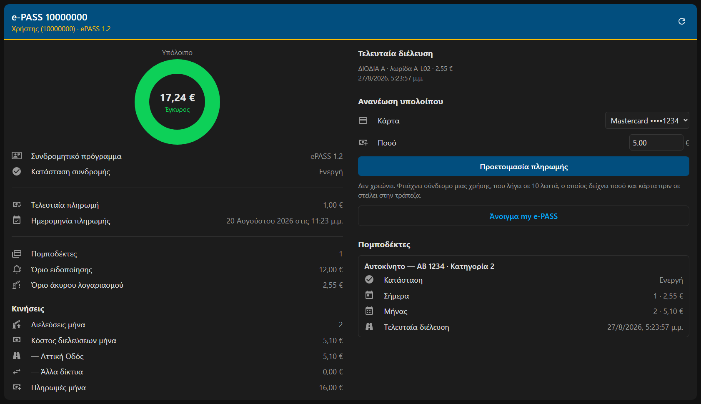
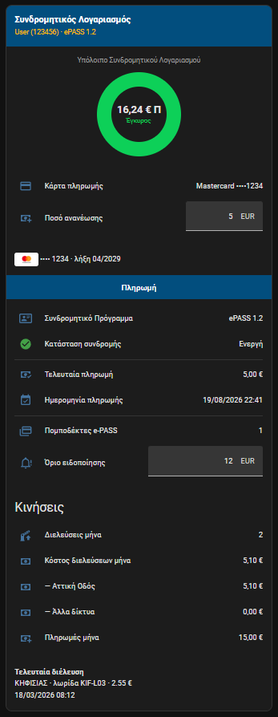

# GR e-PASS για Home Assistant

**Ελληνικά** · [English](README.en.md)

Custom integration που φέρνει τα δεδομένα των **προπληρωμένων λογαριασμών
διοδίων** στο Home Assistant. Υποστηρίζονται η **Νέα Αττική Οδός**
([epass.naodos.gr](https://epass.naodos.gr/)) και η **Νέα Εγνατία Οδός**
([myegnatiapass.gr](https://myegnatiapass.gr/)) — διαλέγεις πάροχο κατά την
προσθήκη. Φέρνει υπόλοιπο,
διελεύσεις, κόστος και στατιστικά — συνολικά και ανά πομποδέκτη — μαζί με
ειδοποίηση χαμηλού υπολοίπου και ανανέωση με ένα tap.

> **Δεν υπάρχει επίσημο API.** Όλα τα endpoints εντοπίστηκαν από το δημόσιο
> Angular bundle του site. Δουλεύουν σήμερα, αλλά μπορούν να αλλάξουν χωρίς
> προειδοποίηση. Δεν είναι επίσημο προϊόν της Νέας Αττικής Οδού.

<p align="center">
  
</p>

<p align="center">
  <em>Η σελίδα «e-PASS» που εμφανίζεται μόνη της στο μενού μετά την εγκατάσταση.
  Κωδικός πελάτη, κάρτα και τελευταία διέλευση είναι δείγματα.</em>
</p>

---

## Τι κάνει

Κατά την εγκατάσταση:

1. Βάζετε **όνομα χρήστη / κωδικό** του my e-PASS.
2. Αν ο λογαριασμός σας έχει **πολλές συνδρομές**, επιλέγετε ποια θα προστεθεί
   (η διαδικασία επαναλαμβάνεται για τις υπόλοιπες).
3. Επιλέγετε **ποιους πομποδέκτες** θέλετε: «Όλοι» (και όσοι προστεθούν στο
   μέλλον) ή συγκεκριμένους από τη λίστα.

Μετά, κάθε 30 λεπτά (ρυθμιζόμενο 10–1440) το integration τραβάει τα στοιχεία
της συνδρομής και τις κινήσεις, και υπολογίζει τα στατιστικά τοπικά.

## Η σελίδα «e-PASS»

Μόλις προστεθεί το integration, εμφανίζεται μια σελίδα **e-PASS** στο μενού.
Δεν χρειάζεται να φτιάξετε dashboard ούτε να γράψετε YAML, και ακολουθεί τη
γλώσσα του Home Assistant — ελληνικά ή αγγλικά.

Δείχνει το υπόλοιπο με τα χρώματα του portal, τα στοιχεία της συνδρομής, τις
κινήσεις του μήνα, την τελευταία διέλευση, την ανανέωση υπολοίπου, και μία
ενότητα για κάθε πομποδέκτη με την κατηγορία οχήματος και τις διελεύσεις του.
Σε οθόνη υπολογιστή μοιράζεται σε δύο κολόνες, σε κινητό σε μία.

Το κουμπί **Προετοιμασία πληρωμής** δεν χρεώνει: φτιάχνει έναν σύνδεσμο μιας
χρήσης που λήγει σε 10 λεπτά και δείχνει ποσό και κάρτα πριν σας στείλει στη
σελίδα της τράπεζας. Λεπτομέρειες στην
[Ανανέωση υπολοίπου](#ανανέωση-υπολοίπου-από-το-home-assistant).

## Εγκατάσταση

### HACS (custom repository)

1. HACS → Integrations → ⋮ → **Custom repositories**
2. URL του repo, κατηγορία **Integration**
3. Εγκατάσταση, μετά **restart** του Home Assistant
4. Settings → Devices & Services → **Add Integration** → `GR e-PASS`

### Χειροκίνητα

Αντιγράψτε τον φάκελο `custom_components/gr_epass` μέσα στο
`config/custom_components/` και κάντε restart.

### Προσθήκη

<p align="center">
  
  &nbsp;
  
</p>

Διαλέγεις πάροχο και βάζεις τα στοιχεία που χρησιμοποιείς στο **δικό του** portal
— ο ίδιος χρήστης υπάρχει ανεξάρτητα σε κάθε πάροχο. Αν ο λογαριασμός έχει πολλές
συνδρομές ακολουθεί βήμα επιλογής, και μετά διαλέγεις πομποδέκτες.

## Ρυθμίσεις μετά την εγκατάσταση

Settings → Devices & Services → GR e-PASS → **Configure**:

- **Πομποδέκτες** — αλλαγή επιλογής (προσθήκη/αφαίρεση)
- **Συχνότητα ανανέωσης** — 10 έως 1440 λεπτά (default 30)

Αν αλλάξετε κωδικό στο site, το Home Assistant ζητά επανασύνδεση (reauth)
αυτόματα.

## Οντότητες

> Τα entity ids παράγονται πάντα από τα **αγγλικά** ονόματα, ανεξάρτητα από τη
> γλώσσα του Home Assistant: `sensor.e_pass_123456_balance`. Ελληνικά
> εμφανίζεται μόνο το friendly name. Δείτε τα πραγματικά ids στο
> Developer Tools → States με φίλτρο `e_pass`.

### Συσκευή: η συνδρομή (`e-PASS <AccountID>`)

| Οντότητα | Περιγραφή |
| --- | --- |
| `sensor.*_balance` | Υπόλοιπο (€) — **θετικό = διαθέσιμη πίστωση**, αρνητικό = οφειλή |
| `sensor.*_balance_status` | Έγκυρος / Χαμηλός / Άκυρος |
| `sensor.*_last_payment` + `sensor.*_last_payment_date` | Ποσό και ημερομηνία τελευταίας πληρωμής |
| `sensor.*_last_statement` | Ημερομηνία τελευταίας εκκαθάρισης, με `issue_number` στα attributes |
| `sensor.*_last_pass` | Timestamp τελευταίας διέλευσης, με attributes σταθμού, λωρίδας, ποσού |
| `sensor.*_passes_today` / `sensor.*_cost_today` | Διελεύσεις και κόστος σήμερα |
| `sensor.*_passes_this_month` / `sensor.*_cost_this_month` | Από την 1η του μήνα |
| `sensor.*_cost_this_month_attiki_odos` | Μόνο διελεύσεις Αττικής Οδού |
| `sensor.*_cost_this_month_other_motorways` | Άλλα δίκτυα μέσω διαλειτουργικότητας |
| `sensor.*_passes_last_30_days` / `sensor.*_cost_last_30_days` | Κυλιόμενο παράθυρο 30 ημερών |
| `sensor.*_passes_previous_month` / `sensor.*_cost_previous_month` | Πλήρης προηγούμενος μήνας |
| `sensor.*_payments_this_month` | Άθροισμα πληρωμών/ανανεώσεων του μήνα (€) |
| `sensor.*_transponders` | Πλήθος πομποδεκτών που παρακολουθούνται |
| `sensor.*_account_status` | Διαγνωστικό: Ενεργή / Ανενεργή / κ.λπ. |
| `sensor.*_stored_cards` | Διαγνωστικό: πλήθος αποθηκευμένων καρτών, με λίστα στα attributes |
| `sensor.*_card_expiry` | Διαγνωστικό: πότε λήγει η πιο κοντινή κάρτα |
| `sensor.*_invalid_balance_limit` | Διαγνωστικό: κάτω από αυτό δεν επιτρέπεται διέλευση |

### Χειριστήρια

| Οντότητα | Περιγραφή |
| --- | --- |
| `number.*_low_balance_threshold` | Πότε θέλετε ειδοποίηση. Default = το επίσημο όριο **της κατηγορίας σας** |
| `select.*_payment_card` | Ποια αποθηκευμένη κάρτα θα χρησιμοποιηθεί |
| `number.*_top_up_amount` | Ποσό ανανέωσης. Default = το Όριο Ανανέωσης της κατηγορίας, όρια από τον gateway |
| `button.*_prepare_top_up` | Ζητά υπογεγραμμένη εντολή. **Δεν χρεώνει** |

Δεν χρειάζεται να φτιάξετε helper: τα κατώφλια έρχονται έτοιμα, προσαρμοσμένα
στην κατηγορία των πομποδεκτών σας, και αλλάζουν από το UI αν θέλετε.

### Συσκευή: κάθε πομποδέκτης

Τα ίδια στατιστικά διελεύσεων/κόστους (σήμερα, μήνας, 30 ημέρες, προηγούμενος
μήνας), `Τελευταία διέλευση`, και ένα διαγνωστικό `Κατάσταση` (Ενεργός / Με
περιορισμό) με attributes: αριθμό πομποδέκτη, alias, πινακίδα, μάρκα/μοντέλο,
κατηγορία διοδίων, `trip_status`, `trip_count`, ημερομηνία χορήγησης.

Αν επιλέξετε συγκεκριμένους πομποδέκτες, τα συνολικά sensors της συνδρομής
μετρούν **μόνο** αυτούς, ώστε τα νούμερα να συμφωνούν με τις συσκευές που
βλέπετε. Οι πληρωμές και οι διαχειριστικές χρεώσεις μπαίνουν πάντα στο σύνολο,
γιατί δεν αντιστοιχούν σε πομποδέκτη.

## Σημαντικά για τα νούμερα

**Το πρόσημο.** Η πύλη κρατά λογιστικό βιβλίο όπου το `AccountBalance` είναι
**αρνητικό όταν έχεις πίστωση**: το `-13.79` του API εμφανίζεται στο portal ως
`13,79 € Π` (Π = Πίστωση, Χ = Χρέωση). Το `Υπόλοιπο` αντιστρέφει το πρόσημο,
ώστε **θετικό = χρήματα διαθέσιμα**.

**Το `Κατάσταση υπολοίπου` αντιστοιχεί σε επίσημα όρια**, όχι σε κάτι που
υπολογίζει το integration. Από τον
[Τιμοκατάλογο Prepaid e-PASS](https://www.naodos.gr/diodia-e-pass/thelo-na-apoktiso-e-pass/timokatalogos-e-pass/)
(ισχύει από 01/01/2026), ανά ηλεκτρονική συσκευή e-PASS:

| Όριο | ΚΑΤ 1 | ΚΑΤ 2,3,4 | ΚΑΤ 5 & 6 |
| --- | --- | --- | --- |
| Ανανέωσης με Πιστωτική Κάρτα (πάγια εντολή) | 10,00 € | 20,00 € | 50,00 € |
| Ειδοποίησης Χαμηλού Λογαριασμού | 6,00 € | 12,00 € | 40,00 € |
| Άκυρου Λογαριασμού | 1,25 € | 2,55 € | 10,10 € |

- `Έγκυρος` = πάνω από το Όριο Ειδοποίησης
- `Χαμηλός` = κάτω από αυτό
- `Άκυρος` = κάτω από το Όριο Άκυρου, όπου **δεν επιτρέπεται καμία
  συνδρομητική διέλευση** — μόνο λωρίδα με εισπράκτορα

Το Όριο Άκυρου ισούται με ένα διόδιο της κατηγορίας. Η κατηγορία του
πομποδέκτη σας είναι στο attribute `toll_category`.

**Τα `cost_*` μετρούν μόνο χρεώσεις διοδίων** (`TransactionType 02`) — όχι τέλη
πομποδέκτη, διαχειριστικά ή προσαρμογές.

**Τα ποσά ημερολογιακών περιόδων** έχουν `state_class: total` και μπαίνουν στα
long-term statistics. Το κυλιόμενο 30ήμερο κόστος **δεν** έχει state class: δεν
είναι μετρητής, πέφτει όταν βγαίνουν παλιές μέρες, και το Home Assistant δεν
δέχεται `measurement` μαζί με `device_class: monetary`.

## Events

Το integration πυροδοτεί events στο bus, ώστε να γράψετε ό,τι automation θέλετε
χωρίς να μαντέψουμε εμείς το κανάλι ειδοποίησης.

| Event | Δεδομένα |
| --- | --- |
| `gr_epass_pass` | `account_id`, `timestamp`, `amount`, `plaza`, `lane`, `transponder_id`, `toll_category`, `external_network` |
| `gr_epass_balance_changed` | `account_id`, `balance`, `previous_balance`, `delta`, `direction` |
| `gr_epass_payment_ready` | `account_id`, `amount`, `card`, `order_id`, `link`, `expires` |

Οι διελεύσεις καταγράφονται σιωπηλά στην πρώτη ανανέωση και αγνοούνται όσες
είναι παλιότερες των 6 ωρών, ώστε ένα restart να μη ξαναστείλει ιστορικό.

## Ανανέωση υπολοίπου από το Home Assistant

Το Home Assistant **δεν μπορεί να χρεώσει κάρτα** και κανένα integration δεν
μπορεί. Το backend του e-PASS μόνο **υπογράφει** μια εντολή; η χρέωση
ολοκληρώνεται με υποβολή HTML form από browser στη hosted σελίδα της Alpha
Bank, όπου τρέχει το 3-D Secure. Δεν υπάρχει endpoint που χρεώνει αποθηκευμένη
κάρτα server-side.

Αυτό που γίνεται:

1. Διαλέγετε κάρτα (`select`) και ποσό (`number`).
2. Πατάτε `button.*_prepare_top_up`. Ζητείται υπογεγραμμένη εντολή — **καμία
   χρέωση**.
3. Δημοσιεύεται σύνδεσμος **μιας χρήσης** που λήγει σε 10 λεπτά, στο attribute
   `link` του button και στο event `gr_epass_payment_ready`.
4. Ανοίγοντάς τον βλέπετε ποσό και κάρτα. Με ένα κλικ μεταφέρεστε στην τράπεζα
   και ολοκληρώνεται η χρέωση.

Ο σύνδεσμος είναι σκόπιμα χωρίς authentication, ώστε να ανοίγει με ένα tap από
Telegram στο κινητό. Τον προστατεύει nonce 128-bit, μία χρήση, λήξη 10 λεπτά,
και το ότι ποσό και κάρτα είναι κλειδωμένα στην υπογραφή — δεν μπορεί να γίνει
edit σε άλλη χρέωση. Το χειρότερο που κάνει μια διαρροή είναι ανανέωση του
**δικού σας** υπολοίπου.

**Η πρώτη χρέωση πρέπει να γίνει στο portal** με «αποθήκευση κάρτας». Το
`SaveStoredCard` σώζει μόνο ένα alias — το token το δημιουργεί η τράπεζα κατά
την πραγματική πληρωμή, οπότε κάρτα δεν προστίθεται από εδώ.

Λεπτομέρειες πρωτοκόλλου: [`docs/PAYMENT_API.md`](docs/PAYMENT_API.md).

### Πάγια εντολή

Ο τιμοκατάλογος περιγράφει «Όριο Ανανέωσης Λογαριασμού με Πιστωτική Κάρτα» που
*«ενεργοποιεί αυτόματα την πάγια εντολή»*. Το **portal δεν την εκθέτει** — δεν
υπάρχει route ούτε endpoint. Αν θέλετε πραγματικά αυτόματη ανανέωση, στήνεται
από τον πάροχο (210 6682222) και δουλεύει τραπεζικά, χωρίς εξάρτηση από το
Home Assistant.

## Παράδειγμα automation: ειδοποίηση χαμηλού υπολοίπου

Το κατώφλι μπαίνει σε `input_number` helper αντί hardcoded, ώστε να αλλάζει από
το UI. Καλή τιμή είναι το επίσημο Όριο Ειδοποίησης της κατηγορίας σας.

```yaml
automation:
  - alias: e-PASS χαμηλό υπόλοιπο
    triggers:
      # Το numeric_state πυροδοτεί στο πέρασμα του ορίου, άρα δεν σπαμάρει.
      # Το for: αποτρέπει ειδοποίηση από ένα μεμονωμένο refresh ή restart.
      - trigger: numeric_state
        entity_id: sensor.e_pass_123456_balance
        below: input_number.epass_low_balance_threshold
        for: "00:10:00"
        id: crossed
      # Ημερήσια υπενθύμιση όσο παραμένει χαμηλό.
      - trigger: time
        at: "09:30:00"
        id: daily
    conditions:
      - condition: numeric_state
        entity_id: sensor.e_pass_123456_balance
        below: input_number.epass_low_balance_threshold
    actions:
      - action: notify.mobile_app_telefono
        data:
          title: e-PASS
          message: >
            Το υπόλοιπο έπεσε στα
            {{ states('sensor.e_pass_123456_balance') }} €.
            Ανανέωση: https://epass.naodos.gr/PaymentA
```

## Απόδειξη πληρωμής

Μετά την πληρωμή η τράπεζα **δεν** επιστρέφει στο Home Assistant. Στέλνει τον
πληρωτή στη σελίδα απόδειξης του my e-PASS, γιατί το URL επιστροφής το υπογράφει
το portal μαζί με την υπόλοιπη εντολή — δεν μπορεί να αλλάξει από το integration.
Εκείνη η σελίδα θέλει σύνδεση στο portal, οπότε συνήθως εμφανίζει φόρμα εισόδου.

Η ίδια απόδειξη είναι διαθέσιμη μέσω API, με το token που κρατά ήδη το
integration. Στη σελίδα e-PASS εμφανίζεται κουμπί **Προβολή απόδειξης** αφού
σταλεί μια πληρωμή στην τράπεζα, που την ανοίγει σε δικό της παράθυρο με
εκτύπωση/PDF και επιστροφή. Και ως υπηρεσία, για αυτοματισμούς:

```yaml
action: gr_epass.get_receipt
data:
  wait: true
```

Χωρίς `order_id` χρησιμοποιεί την τελευταία εντολή που στάλθηκε στην τράπεζα. Το
`wait: true` επαναλαμβάνει έως τριάντα δευτερόλεπτα, γιατί η τράπεζα επιβεβαιώνει
την πληρωμή ξεχωριστά· αν ζητηθεί πολύ νωρίς, η απάντηση είναι
`found: false`.

## Παραδείγματα dashboard

- [`dashboard-example.yaml`](dashboard-example.yaml) — απλό view με core cards.
- [`dashboard-portal-card.yaml`](dashboard-portal-card.yaml) — κάρτα σε στιλ της
  «Αρχικής» του my e-PASS: donut υπολοίπου με τη λογική χρωμάτων του portal,
  επιλογή κάρτας με σήμα, ποσό, και κουμπί πληρωμής. Θέλει από το HACS
  `button-card`, `card-mod`, `vertical-stack-in-card`, `template-entity-row`.
- [`dashboard-portal-card.en.yaml`](dashboard-portal-card.en.yaml) — η ίδια
  κάρτα με αγγλικά labels. **Παράγεται** από την ελληνική με
  `python tools/make_en_card.py` — μην την επεξεργάζεστε χειροκίνητα.

<p align="center">
  
</p>

## Το API που δεν υπάρχει

Το `epass.naodos.gr` είναι Angular SPA. Το `assets/clientConfig.json` δεν έχει
`serverUrl`, οπότε όλα τα calls πάνε same-origin. Το reCAPTCHA είναι
απενεργοποιημένο για αυτόν τον client (δεν υπάρχει κλειδί `GoogleRecaptch`),
γι' αυτό το login περνάει καθαρά.

| Λειτουργία | Endpoint |
| --- | --- |
| Login | `POST /oauth2/token` — `grant_type=password`, `client_id=100`, `client_secret=secret`, header `Content-Type: x-www-form-urlencoded` και `Audience: Any` |
| Ανανέωση session | `POST /oauth2/token` — `grant_type=refresh_token` |
| Συνδρομές του χρήστη | `GET /api/Account/GetUserAccountsInfo` |
| Στοιχεία συνδρομής | `GET /api/Account/GetAccount/{accountId}` |
| Πομποδέκτες + οχήματα | `GET /api/Account/GetTransponderVehicleInfo/{accountId}` |
| Κινήσεις | `POST /api/Account/GetAccountRecentActivities` |
| Εκκαθαρίσεις | `GET /api/Account/GetAccountBillingDateInfo?accountId=` |
| Αποθηκευμένες κάρτες | `GET /api/alphaPaym/GetStoredCards` |
| Όρια gateway | `GET /api/alphaPaym/GetPaymProviderInfo` |
| Υπογραφή εντολής | `POST /api/alphaPaym/PrepAlphaPayment` |

Το `GET /api/Account/GetStatementInfoRecords?accountId=` επιστρέφει **HTTP 500**
και δεν χρησιμοποιείται.

Κάθε κλήση φέρνει `Authorization: Bearer <access_token>` και ένα κενό header
`gid` (εκεί βάζει το SPA το reCAPTCHA token).

Τύποι κινήσεων (`TransactionType`): `01` πληρωμή, `02` διόδια, `03` χρέωση
πομποδέκτη, `04` διαχειριστικά, `05` προσαρμογή, `06` επιστροφή, `07` φόρος.
Στις χρεώσεις το `TransactionAmount` είναι **θετικό**, στις πληρωμές αρνητικό.

Δεν υπάρχει μοναδικό id κίνησης — το integration φτιάχνει fingerprint από
`TransactionLDateTime` + `SysPostLDateTime` + πομποδέκτη + ποσό + `PlazaId` +
`NodeId` + `LaneText`, για να μη διπλομετρήσει όταν επικαλύπτονται τα chunks.

Το `PlazaExternal = "Y"` σημαίνει διέλευση σε **άλλο** δίκτυο μέσω
διαλειτουργικότητας. Στις διελεύσεις Αττικής Οδού έρχεται `null` (όχι `"N"`). Η
περίπτωση `"Y"` είναι **επιβεβαιωμένη μόνο από τον κώδικα του SPA**, όχι από
πραγματικά δεδομένα — αν έχετε διελεύσεις σε άλλο δίκτυο και το
`Κόστος διελεύσεων μήνα (άλλοι αυτοκινητόδρομοι)` μένει 0, ανοίξτε issue.

Η κατάσταση πομποδέκτη βγαίνει από το `RestrictionStatus` (`2` = εντάξει). Το
`ViewTransponderStatus` υπάρχει στα models του SPA αλλά **δεν επιστρέφεται** από
το API, και ο χάρτης `eTransponderRestrictionMap` δεν είναι υλοποιημένος στο
`getMapValue` — γι' αυτό και η ίδια η πύλη δείχνει μόνο εικονίδιο χωρίς κείμενο.

## Περιορισμοί

- Το backend **απορρίπτει διαστήματα μεγαλύτερα από 30 ημέρες**. Το integration
  σπάει αυτόματα τα αιτήματα σε κομμάτια, γι' αυτό ένα refresh κάνει 3–5 κλήσεις.
- Ο προηγούμενος μήνας τραβιέται **μία φορά** και μένει στη μνήμη μέχρι να
  αλλάξει μήνας.
- **Η πύλη είναι σχεδόν πραγματικού χρόνου** — σε μετρήσεις, μια διέλευση
  καταχωρήθηκε την ίδια στιγμή που έγινε και μια πληρωμή μέσα σε 56 δευτερόλεπτα.
  Η καθυστέρηση που βλέπετε είναι **του polling**, όχι της πύλης· κατεβάστε το
  interval αν θέλετε πιο άμεσα δεδομένα.
- Το `AccountBalance` είναι πάντα η τιμή που δίνει το portal. Δεν υπολογίζεται
  τοπικά.
- Ο κωδικός αποθηκεύεται στο config entry του Home Assistant, γιατί το API
  απαιτεί password grant σε κάθε νέο login.

## Εργαλείο ελέγχου

Αν κάποιος αισθητήρας δείχνει `unknown` ή λάθος τιμή, τρέξτε το probe στο PC σας
για να δείτε τι επιστρέφει πραγματικά το API. Χρησιμοποιεί μόνο τη standard
library — δεν χρειάζεται `pip install`.

```bash
python tools/epass_probe.py TO_USERNAME_MOY --days 14
```

Ο κωδικός ζητείται από το τερματικό (δεν εμφανίζεται) ή διαβάζεται από τη
μεταβλητή `EPASS_PASSWORD`. Το αποτέλεσμα γράφεται σε `epass_probe_output.json`
με τα προσωπικά πεδία (ονόματα, πινακίδες, ΑΦΜ, email) αντικατεστημένα με
`<redacted>` — βάλτε `--no-redact` μόνο αν το θέλετε πλήρες και δεν θα το
μοιραστείτε.

## Άδεια

[MIT](LICENSE).
